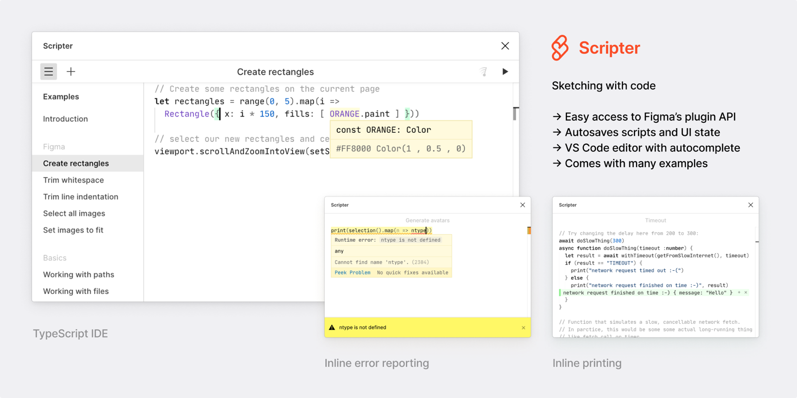
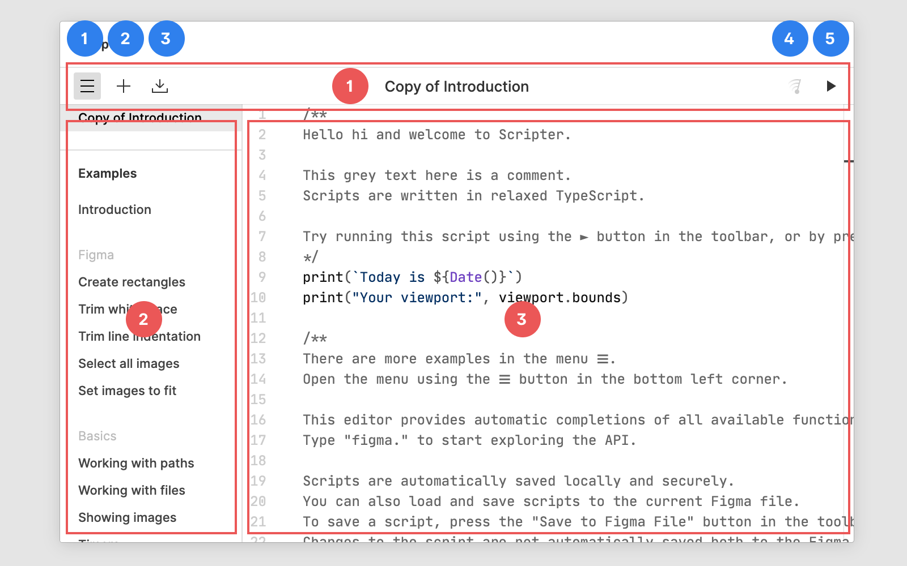
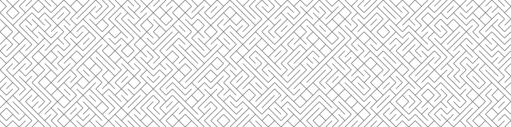
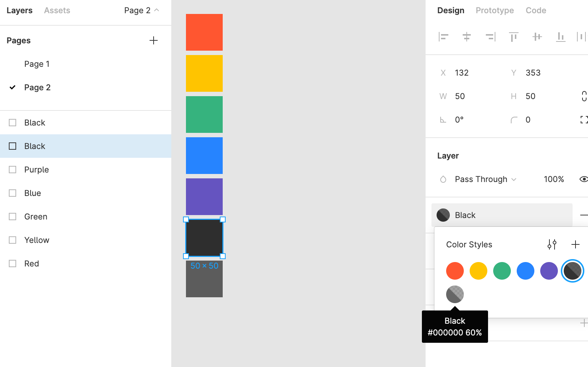
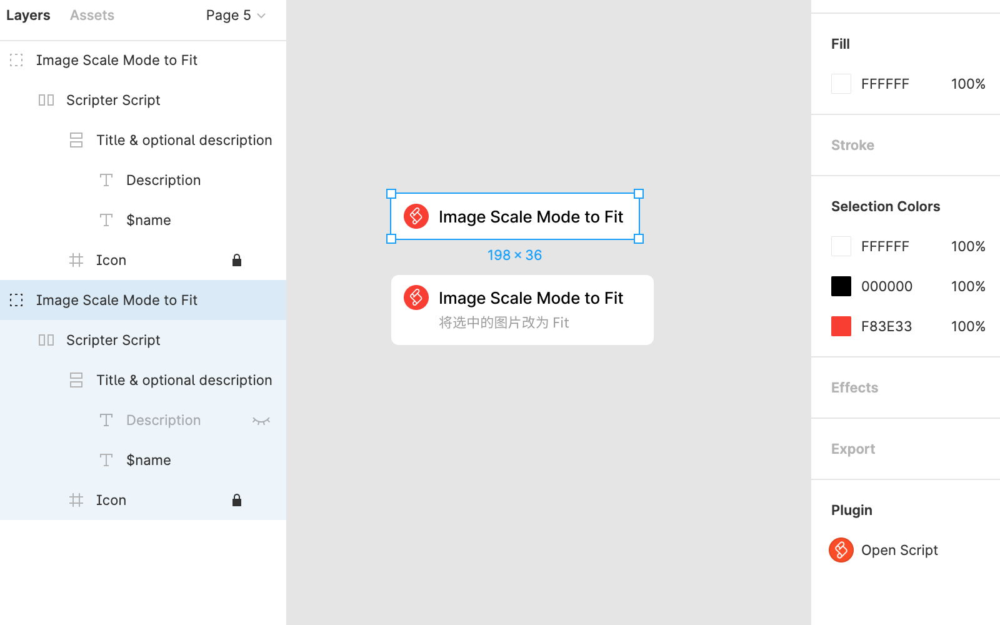

# 快速入门

## 概述



[Scripter](https://www.figma.com/community/plugin/757836922707087381/Scripter) 是由 Figma 公司的设计师 [Rasmus](https://rsms.me/) 开发的[开源](https://github.com/rsms/scripter)插件，可用于运行脚本来做 Figma 的自动化操作，或试验 Figma 插件 API 脚本。

Scripter 使用 TypeScript 作为编程语言，而 Figma 的插件使用 JavaScript，也可以用 TypeScript (最终程序由转为 JavaScript)，即使用了 TypeScript 的插件，代码也不能跟 Scripter 完全通用。Scripter 除了支持绝大部分 Figma  插件 API，还增加一些特有的功能，例如请求网络文件和动画，简化了一些 API 代码。另外 Scripter 不支持浏览器特有的 API，或者引入某个库，所以如果需要某种依赖浏览器 API 或者特定库的功能，则需要做成插件，无法在 Scripter 上实现。由于 Scripter 本身也是一个插件，所以无法再出现一个表单窗口用于参数输入。Scripter 目前无法读取本地文件。

总而言之，可以理解为 Scripter 偏向于在 Figma 已有插件接口的基础上实现自动化操作，而插件则有更多想象空间。

所以除了所有编程语言都会有那些数学运算、循环等等之外，Scripter 可以让 Figma 快速选择和定位特定的图层，创建各种类型图层或修改属性，创建和修改样式组件，读取网络上的数据填充到设计上等等。

### Scipter 支持的特性

- 大部分 Figma plugin API，例如读取和编辑各种节点的属性。
- 读取网络上的图片、文本、JSON 文件。
- 动画，这里指的是利用长时间运行的脚本按一定的时间间隔持续改变画布上的图层，达到动画效果，不是在 Figma 上制作 Gif 或视频之类的动画。

### Scipter 暂不支持的特性

- 不支持小部分  Figma plugin API，例如显示插件 UI 弹窗，存储数据等。
- 不支持在代码中引用第三方库。
- 不支持读取本地文件，和将资源保存到本地。

## 界面介绍



### 界面

Scripter 界面比较简单，分为 3 个区域，工具栏，菜单栏和编辑区。

1. 工具栏。
   1. Show/Hide Menu  ⌃M，显示或隐藏菜单。
   2. New Script，新建脚本。
   3. Save to Figma File，保存到文档。
   4. Clear messages ⌘K，清除信息。
   5. Run ⌘↩︎，运行脚本 。
2. 侧边栏菜单。包括文件列表、示例 (Examples)、参考 (References)和编辑器设置 (Settings)，通常编写代码可以关闭侧边菜单。
3. 编辑区。

### 编辑器设置

编辑器的设置如下，可以根据个人喜好选择是否开启某个功能。

- Line numbers。显示行号。
- Word wrap。代码自动折行。
- Monospace font。使用等宽字体。
  - Font ligatures。使用连体，开启这个选项会让某些字符组合显示为一个字符，例如 `!= >= <=` 会显示为 `≠ ≥ ≤`。
- Show whitespace。显示空白符。
- Indentation guides。显示缩进参考线。
- Hover cards。显示提示卡片。
- Quick suggestions。代码提示。
- Code folding。代码折叠。
- Minimap。显示代码缩略图。
- WxH window。窗口大小，XL 超大，L 大，M 中，S 小。

### 新建脚本

新建脚本时，如果没有内容，脚本会自动删除。双击或右击菜单栏的脚本名称可以重命名脚本，重命名为空时文件会被删除。

## 编程体验

通常教编程的书籍，入门就是安装配置环境，然后输出 “Hello World”。这种入门体验，对于设计师来讲，没有太大感知，这里选用了 3 个简单的示例，分别是绘制矩形、生成艺术、批量创建填充样式。

### 示例 1: 绘制矩形

首先新建一个文档或页面，从 Plugin 菜单中打开 Scripter，点击 New Script 图标新建脚本，然后复制以下代码到编辑器，点击运行图标。

脚本将创建一个 24x24 的红色矩形，并将画布可视区域聚焦到矩形图层。

```typescript
let rect = Rectangle({
  x: 0,
  y: 0,
  width: 24,
  height: 24,
  fills: [{
    type: 'SOLID',
    color: {r: 1, g: 0, b:0 }
  }]
});
figma.viewport.scrollAndZoomIntoView([rect]);
```

### 示例 2: 生成艺术



首先新建一个文档或页面，复制以下代码到新建的脚本中，运行脚本后将创建 800x200 的迷宫图案，实际上是按坐标随机产生左右倾斜 45 度的线段。

```typescript
let stroke = 1;
let offset = Math.sqrt(stroke / 2 * stroke / 2 / 2);
for (let x = 0; x < 800; x += 10) {
  for (let y = 0; y < 200; y += 10) {
    let random = Math.random();
    Line({
      x: random > 0.5 ? x + offset : x - offset,
      y: random > 0.5 ? y + 10 + offset : y + offset,
      width: Math.sqrt(10 * 10 + 10 * 10),
      height: 0,
      rotation: random > 0.5 ? 45 : -45,
      strokeWeight: stroke,
      strokes: [
        {
          type: 'SOLID',
          color: {r: 0.5, g: 0.5, b: 0.5}
        }
      ]
    });
  }
}
```

### 示例 3: 批量创建填充样式。



首先在页面上创建一些形状并填充不同颜色，将图层名称修改为填充样式的名称，然后复制代码到 Scripter 新建脚本中，运行脚本后，脚本会计算颜色的 16 进制色值和透明度，并将其作为填充样式的描述，最后样式创建成功给图层绑定相应的样式。

```typescript
for (let node of figma.currentPage.selection) {
  let fill = (node as GeometryMixin).fills[0];
  if (fill.type === 'SOLID') {
    let name = node.name;
    let description = '#' + Object.values(fill.color).map((component: number) => {
      let hex: string = Math.round(component * 255).toString(16).toUpperCase();
      return (hex.length === 1 ? '0' : '') + hex;
    }).join('');
    if (fill.opacity !== 1) {
      description += ' ' + Math.round(fill.opacity * 100) + '%';
    }
    let style = figma.createPaintStyle();
    style.name = name;
    style.description = description;
    style.paints = [fill];
    (node as GeometryMixin).fillStyleId = style.id;
  }
}
```

## 保存和共享脚本

用户建立的脚本是自动保存在浏览器上的，如果你同时使用桌面客户端和浏览器端，或者在不同地方使用浏览器端，数据都是不可共享的，而且可能因为清理浏览器数据导致脚本文件丢失。

Scripter 提供一个 “Save to Figma File” 的功能，实际上是将当前的脚本保存到 Scripter 创建一组图层上。图层组内有一个隐藏的 Description 文本图层，可以将其显示出来，并添加描述。选中这组图层时，右侧面板的底部会出现插件信息，共享此文件时也同时共享了文件上的脚本，但这种方式会因图层被删除而导致数据丢失。使用这种方式时，要将这个脚本图层放在显眼的地方，并做好备注，以及和写作者沟通好防止被误删。

比较保守和安全的做法是本地保存一份，或者使用 [Github](https://github.com/) 或 [Gist](https://gist.github.com/) 管理。


