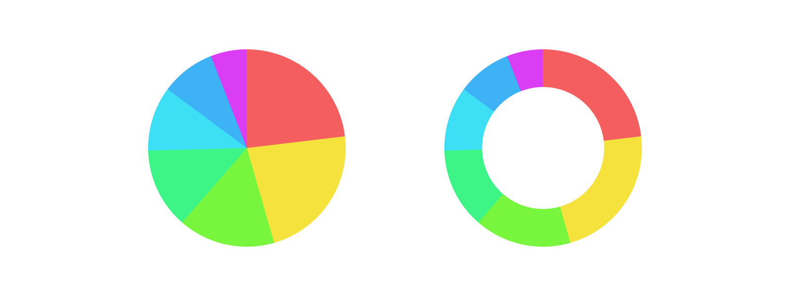
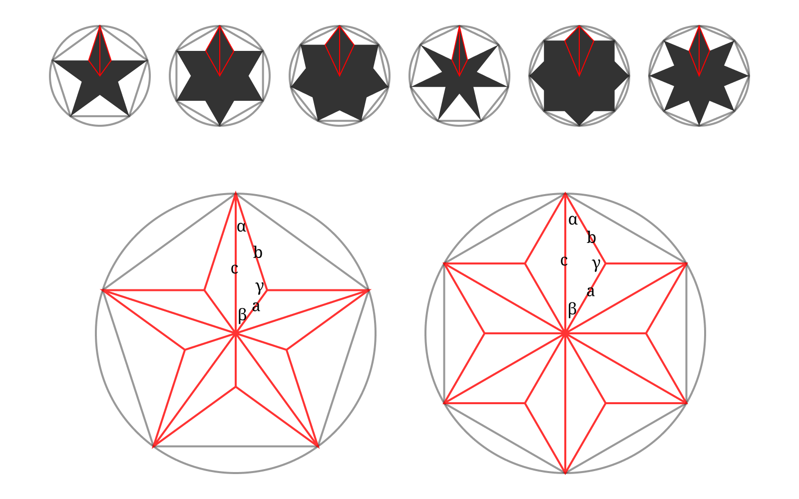

# 形状

## 概述

Figma Plugin API 中有一些 `figma.createXXX()` 形式的函数用于创建图形。通过这些函数先创建图形，再修改各种属性的值，然后插入到页面中。不同的图层类型会有不同的属性，具体可以参考官方文档或声明文件。

```typescript
// Figma Plugin API Typings
interface PluginAPI {
	// ...
  createRectangle(): RectangleNode
  createLine(): LineNode
  createEllipse(): EllipseNode
  createPolygon(): PolygonNode
  createStar(): StarNode
  // ...
  createNodeFromSvg(svg: string): FrameNode
}
```

Scripter 增加了一些创建图形的函数，可以直接将图层属性作为参数，可以解决相同属性共用的问题。

```typescript
// Scripter Typings
declare function Rectangle(props? :NodeProps<RectangleNode>) :RectangleNode;
declare function Line(props? :NodeProps<LineNode>|null): LineNode;
declare function Ellipse(props? :NodeProps<EllipseNode>|null): EllipseNode;
declare function Polygon(props? :NodeProps<PolygonNode>|null): PolygonNode;
declare function Star(props? :NodeProps<StarNode>|null): StarNode;
```

## 基础形状

### 矩形

使用 Figma Plugin API 方式创建矩形。

```typescript
let layer = figma.createRectangle();
layer.x = 0;
layer.y = 0;
layer.resize(24, 24);
layer.fills = [
  {
    type: "SOLID",
    color: {r: 1, g: 0, b: 0}
  }
];
figma.currentPage.appendChild(layer);
```

使用 Scripter API 方式创建矩形。

```typescript
let propreies: NodeProps<RectangleNode> = {
  x: 0,
  y: 0,
  width: 24,
  height: 24,
  cornerRadius: 8,
  fills: [RED.paint]
};
addToPage(Rectangle(propreies));
addToPage(Rectangle({...propreies, x: 48, y: 0}));
```

增加统一圆角，可以增加以下属性。

```typescript
cornerRadius: number, // 圆角半径
cornerSmoothing: number, // 圆角平滑, 值 0 - 1 默认为 0
```

增加不同圆角，可以增加以下属性，未定义时默认为 0。

```typescript
topLeftRadius: number, // 左上圆角半径
topRightRadius: number, // 右上圆角半径
bottomLeftRadius: number, // 左下圆角半径
bottomRightRadius: number, // 右下圆角半径
```

### 圆形

在 Figma 中创建圆形的核心是 `ArcData` 对象，通过这个对象的 3 个属性可以衍生出包括圆环、饼形、扇形和弧线等图形。`ArcData.startingAngle` 和 `ArcData.endingAngle` 的值是从圆的右侧中间点算的弧度值，正数为顺时针旋转，复数为逆时针旋转，2 个值的取值范围为绝对值在 0 至 2 倍圆周率（即 360 度弧度）的正负数。 起始角度的控制点为 ⊙ 。`ArcData.innerRadius` 为内半径与外半径的比例，取值范围 0 - 1。

```typescript
// Figma Plugin API Typings
interface ArcData {
  readonly startingAngle: number
  readonly endingAngle: number
  readonly innerRadius: number
}
```

以下公式可以将现实中使用的角度或百分比转为 `startingAngle` 和 `endingAngle` 所需的弧度。

$ rad = deg \times \pi \div 180 = percent \times \pi \times 2$

弧度转角度公式。

$deg = rad \times 180 \div \pi$

知道圆的弧度值就可以创建圆形，通过更改 `ArcData.innerRadius` 值可得到圆环。

```typescript
let layer = figma.createEllipse();
layer.x = 0;
layer.y = 0;
layer.resize(200, 200);
layer.arcData = {
  startingAngle: 0,
  endingAngle: Math.PI * 2,
  innerRadius: 0 // 修改范围 0 - 1 可得圆环
};
figma.currentPage.appendChild(layer);
```

通过利用 `startingAngle` 和 `endingAngle` 的关系，可以创建等分饼图。示例中使用随机色填充，如果需要色环效果，可以从色彩章节中找到 HSL 或 HSB 转 RGB 的函数。

```typescript
let count = 8;
for (let i = 0; i < count; i++) {
  let layer = figma.createEllipse();
  layer.x = 0;
  layer.y = 0;
  layer.resize(200, 200);
  layer.arcData = {
    startingAngle: i * Math.PI * 2 / count,
    endingAngle: (i + 1) * Math.PI * 2 / count,
    innerRadius: 0
  }
  layer.fills = [{
    type: "SOLID",
    color: {r: Math.random(), g: Math.random(), b: Math.random()}
  }];
  figma.currentPage.appendChild(layer);
}
```

创建数据饼图。



```typescript
// 数据
const data = [{
    name: 'Apples',
    value: 70
}, {
    name: 'Strawberries',
    value: 68
}, {
    name: 'Bananas',
    value: 48
}, {
    name: 'Oranges',
    value: 40
}, {
    name: 'Pears',
    value: 32
}, {
    name: 'Pineapples',
    value: 27
}, {
    name: 'Grapes',
    value: 18
}];
// 可用色彩，数目不需要与数据项相同
const colors = ['F55E5E', 'F5E23D', '78F53D', '3DF587', '3DDFF5', '3DB3F5', 'DB3DF5'];
// 统计数据中所有数值的总和，用于计算百分比
const count = data.map(item => item.value).reduce((a, b) => a + b, 0);
// 饼图的起点为顶部正中，而不是默认的右侧中间点
let startingAngle = -90 * Math.PI / 180; // 或 -0.25 * Math.PI * 2
for (let i = 0; i < data.length; i++) {
  // 数据项的值所占的弧度
  let rad = (data[i].value / count) * Math.PI * 2;
  let layer = figma.createEllipse();
  layer.x = 0;
  layer.y = 0;
  layer.resize(200, 200);
  layer.arcData = {
    startingAngle: startingAngle,
    endingAngle: startingAngle + rad,
    innerRadius: 0 // 修改范围 0 - 1 可得圆环
  }
  layer.fills = [Color(colors[i % colors.length]).paint];
  figma.currentPage.appendChild(layer);
  // 当前项的终点，即是下一项的起点
  startingAngle += rad;
}
```

从示例中可以看出，`ArcData` 的 3 个属性并不等价于界面中的 Start、Sweep、Ratio 3 个参数，如果需要使用界面的参数作为输入创建 `ArcData` 对象，需要自定义转换函数。

```typescript
function arcData(start: number, sweep: number, ratio: number): ArcData {
  let startingAngle = start * Math.PI / 180;
  let endingAngle = (sweep + (start / 3.6)) * 3.6 * Math.PI / 180;
  let innerRadius = ratio;
  return {startingAngle, endingAngle, innerRadius}
}
```

### 多边形

Figma 中的多边形是正多边形，`PolygonNode.pointCount` 属性表示边数量，取值必须大于等于 3 的整数，未定义时默认值为 3。

```typescript
let layer = figma.createPolygon();
layer.x = 0;
layer.y = 0;
layer.resize(300, 300);
layer.pointCount = 5;
figma.currentPage.appendChild(layer);
```

### 星形

星形的创建与多边形类似，多了一个 `StarNode.innerRadius` 属性表示内半径与外半径的比例，取值范围 0 - 1，默认为 0.382，当值为 1 时即是两倍的多边形。`StarNode.pointCount` 属性未定义时默认值为 5。

```typescript
let layer = figma.createStar();
layer.x = 0;
layer.y = 0;
layer.resize(300, 300);
layer.pointCount = 5;
layer.innerRadius = 0.382;
figma.currentPage.appendChild(layer);
```



正 n 角星形是指将圆周上平分为 n 份，n 个端点的连线形成正多边形，而相间隔 1 个以上端点之间的连线形成正 n 星形。如图½ 顶角为 α，外半径与内半径夹角为 β，α 对边内半径为 a，已知值外半径为 c，其对角为 γ。

α 角计算公式，d 表示端点间隔。

$$\alpha={{180 \times (n - 2 \times d)} \over 2 \times n}={90 \times (n-2 \times d) \over n}, 1 < d < {n \over 2}$$

β 角计算公式。

$$\beta={360 \over 2 \times n}={180 \over n}$$

γ 角计算公式。

$$\gamma=180-{{90 \times (n - 2 \times d)} \over n}-{180 \over n}, 1 < d < {n \over 2}$$

已知 α、β、γ 角及 c 边值，根据正弦定理（R 为三角形外接圆半径），推算出内半径与外半径的比例 $a \over c$ 的值。

$${a \over sin\alpha}={b \over sin\beta}={c \over sin\gamma}=2R \rightarrow {a \over c} = {sin\alpha \over  sin\gamma}$$

转为弧度值。

$${a \over c} = {{sin({(n-2 \times d) \times \pi \over 2 \times n})} \over {sin(\pi - {(n-2 \times d) \times \pi \over 2 \times n} - {\pi \over n})}}, 1 < d < {n \over 2}$$

将公式转为如下的 JavaScript 代码。

```typescript
Math.sin((n-2*d)*Math.PI/(2*n)) / Math.sin(Math.PI-(n-2*d)*Math.PI/(2*n)-Math.PI/n);
```

下面的代码可以输出正 5-20 星形可用的  innerRadius 值。

```typescript
for (let n = 5; n < 20; n++) {
  let d = 2;
  let innerRadius: number[] = [];
  for (let d = 2; d < n/2; d++) {
    innerRadius.push(Math.sin((n-2*d)*Math.PI/(2*n)) / Math.sin(Math.PI-(n-2*d)*Math.PI/(2*n)-Math.PI/n));
  }
  console.log(n, ...innerRadius)
}
```

下面列出几个常见正 n 角形的 innerRadius 值。

| n    | innerRadius         |
| ---- | ------------------- |
| 5    | 0.382               |
| 6    | 0.577               |
| 7    | 0.692, 0.357        |
| 8    | 0.765, 0.541        |
| 9    | 0.815, 0.653, 0.347 |
| 10   | 0.851, 0.727, 0.526 |

### 直线

直线没有特殊的属性，`width` 即是直线长度，`height` 一直为 0，通过旋转得到非水平方向直线。这种方式导致要实现两点之间的连线，就需要计算两点之间距离和角度，公式如下。 

$$|AB|=\sqrt{(x_1-x_2)^2+(y_1-y_2)^2}$$

$$\alpha=tanh({{y_1-y_2}\over{x_1-x_2}})\times180\div\pi$$

由于直线的坐标不是基于中线算的所以需要考虑因描边带来的位置误差。

```typescript
let [x1, y1, x2, y2] = [0, 0, 500, 300];
let layer = figma.createLine();
let length = Math.abs(Math.sqrt((x1-x2)**2+(y1-y2)**2));
layer.resize(length, 0);
layer.strokeWeight = 20;
layer.rotation = -Math.tanh((y1-y2)/(x1-x2)) * 180 / Math.PI;
layer.x = x1 + Math.sin(layer.rotation*Math.PI/180) * layer.strokeWeight / 2;
layer.y = y1 + Math.sin((90-layer.rotation)*Math.PI/180) * layer.strokeWeight / 2;
figma.currentPage.appendChild(layer);
```

## 使用 SVG

SVG

## 旋转和倾斜变换

旋转和倾斜变换

## 自定义函数

API 提供的创建形状方法比较繁琐，在做某些生成艺术时，需要绘制很多图形，可以重新定义新的函数，以便更加直观和方便的创建图形，可以。

例如创建一个单色矩形，只需要提供矩形的坐标、尺寸，以及色值。尺寸和色值也可作为可选项，默认创建 100x100 的黑色矩形。

```
drawRectangle(x: number, y: number, width?: number, height?: number, color?: string)
```

